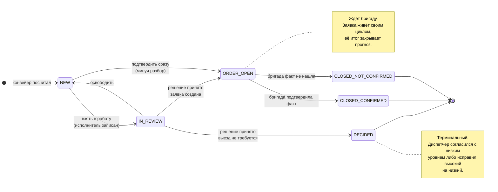
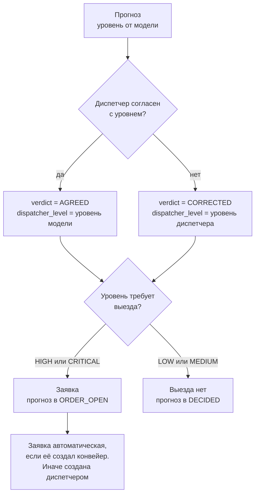
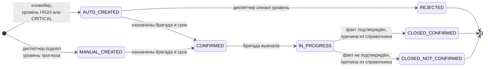
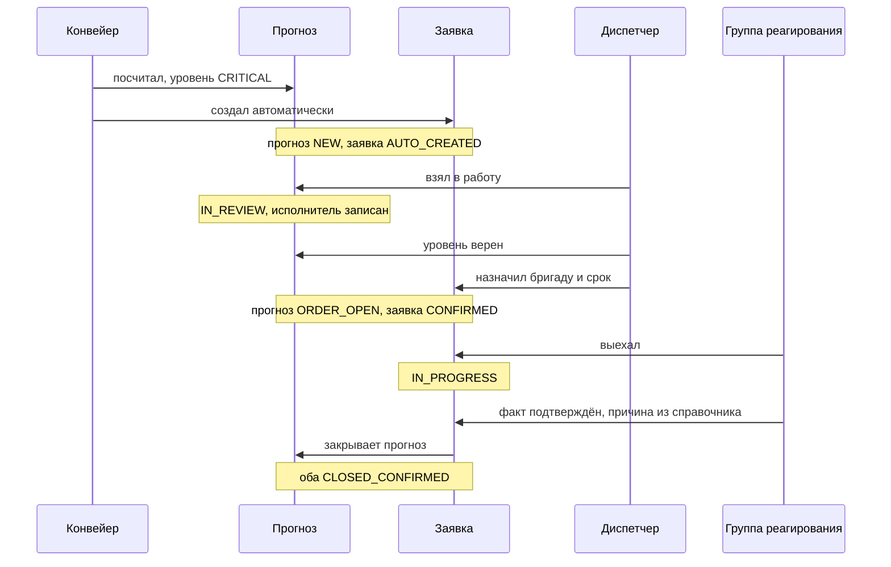

# Путь прогноза и заявки

Схема описывает, что происходит с прогнозом от расчёта до закрытия и как с ним
связана заявка. Источник истины по статусам: `backend/app/meta/catalog.py` и
`backend/app/domain/transitions.py`. Правки схемы и кода идут одним коммитом.

Обоснование модели лежит в `backend/docs/adr/0006-prediction-lifecycle.md`.

## Главное в двух предложениях

Статус отвечает на вопрос «где прогноз в работе», а не «что решил диспетчер».
Решение диспетчера лежит отдельными полями, потому что оно является ярлыком для
дообучения модели, а не состоянием процесса.

## Путь прогноза

| Статус | Подпись | Терминальный | Что значит |
|---|---|---|---|
| `NEW` | Новый | нет | конвейер посчитал, человек не смотрел |
| `IN_REVIEW` | В работе | нет | диспетчер взял на себя, имя записано |
| `DECIDED` | Решение принято | **да** | выезд не нужен, история закончена |
| `ORDER_OPEN` | Заявка в работе | нет | ждёт итога бригады |
| `CLOSED_CONFIRMED` | Закрыт: факт подтверждён | **да** | бригада нашла то, что предсказали |
| `CLOSED_NOT_CONFIRMED` | Закрыт: факт не подтверждён | **да** | бригада не нашла |

## Решение диспетчера: два поля, а не два статуса

Диспетчер отвечает на один вопрос: **верен ли уровень критичности**.

Правило одно и не зависит от того, согласился диспетчер или исправил:
**нужен ли выезд, решает итоговый уровень `dispatcher_level`.**

Отсюда четыре случая, и ни один не остаётся без последствия.

| Уровень модели | Уровень диспетчера | Что происходит |
|---|---|---|
| LOW или MEDIUM | тот же | выезда нет, прогноз закрыт |
| LOW или MEDIUM | HIGH или CRITICAL | диспетчер создаёт заявку, она обязательна |
| HIGH или CRITICAL | тот же | автозаявка подтверждается |
| HIGH или CRITICAL | LOW или MEDIUM | автозаявка отклоняется, прогноз закрыт |

Старое поведение, где «Отклонён» не влекло ничего, кроме подавления на неделю,
этой таблицей закрыто.

## Путь заявки

| Статус | Подпись | Терминальный |
|---|---|---|
| `AUTO_CREATED` | Создана автоматически | нет |
| `MANUAL_CREATED` | Создана диспетчером | нет |
| `CONFIRMED` | Подтверждена, бригада назначена | нет |
| `IN_PROGRESS` | В работе | нет |
| `REJECTED` | Отклонена диспетчером | **да** |
| `CLOSED_CONFIRMED` | Закрыта: факт подтверждён | **да** |
| `CLOSED_NOT_CONFIRMED` | Закрыта: факт не подтверждён | **да** |

Статус `IN_PROGRESS` оставлен намеренно. Он отвечает на вопрос «что бригады
делают прямо сейчас», а это главный срез сменного диспетчера.

## Как связаны два пути

Заявка закрывает прогноз, а не наоборот. Поэтому итог бригады попадает в
прогноз без дублирования: у прогноза нет своего поля исхода.

## Что из этого идёт в дообучение

Схема даёт два разных ярлыка, и смешивать их нельзя. Разбор в
`backend/docs/06-labels-and-metrics.md`.

| Ярлык | Кто ставит | Покрытие | Что измеряет |
|---|---|---|---|
| `dispatcher_level` | диспетчер | **все прогнозы** | верен ли уровень |
| итог заявки | группа реагирования | только где был выезд | наступил ли факт |

Первый ярлык дешёвый и полный. Он не заменяет второй, но делает смещение
второго измеримым: видно, чем прогнозы с выездом отличаются от прогнозов без
него. До этой схемы разметку получали только прогнозы с выездом, и сравнивать
было не с чем.

## Выгрузка журнала

Колонки отвечают ТЗ §10, где журнал обязан держать «историю прогнозов и
результаты их отработки».

| Колонка | Источник |
|---|---|
| Прогноз | `prediction.summary`, направление, объект, момент расчёта |
| Критичность | `prediction.level`, уровень модели |
| Действие диспетчера | `verdict`, `dispatcher_level`, исполнитель, момент решения |
| Результат от бригады | итог заявки, фактическая причина, комментарий |

## Кто что может

Роли из ответа заказчика 4.1. Полный разбор в
`backend/docs/adr/0007-roles-and-auth.md`.

| Роль | Видит | Может |
|---|---|---|
| Техник | один комплекс | читать |
| Диспетчер района | комплексы своего района | брать в работу, решать, создавать заявки |
| Диспетчер ОДС | всё предприятие | то же на всём предприятии |
| Группа реагирования | назначенные заявки | переводить заявку в работу и закрывать её итогом |
